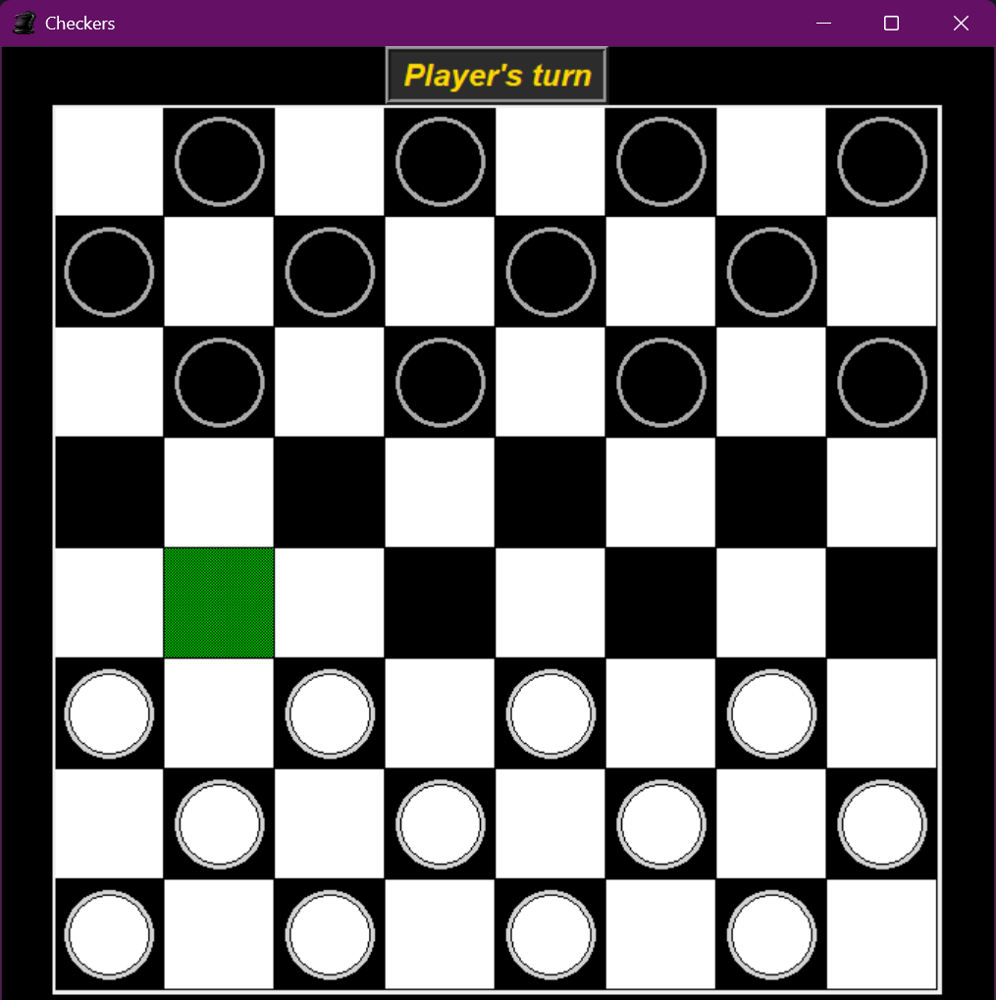
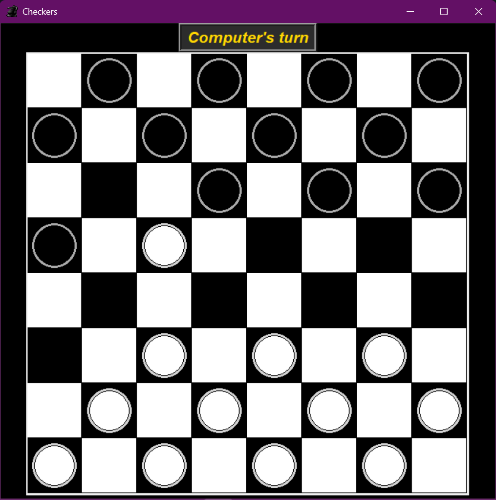
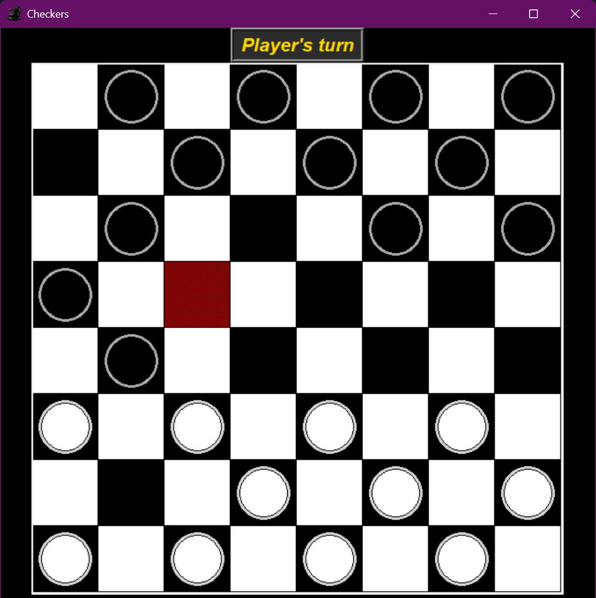
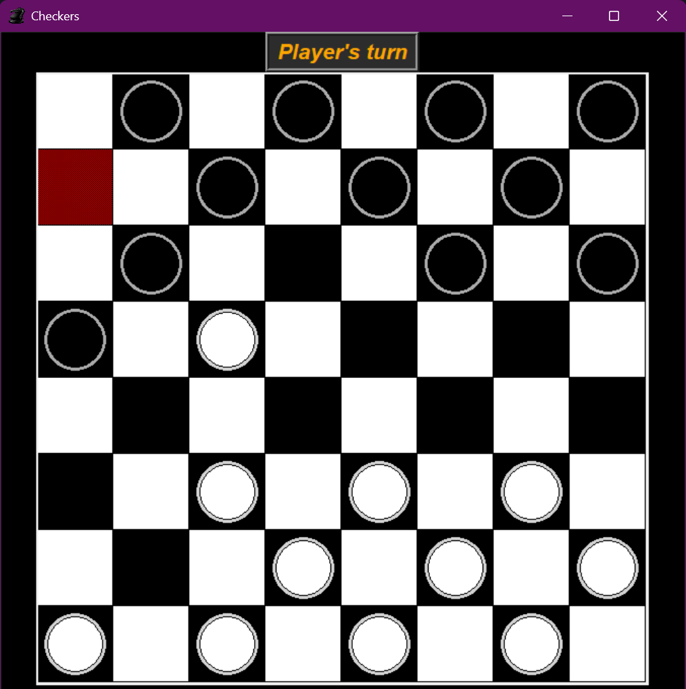
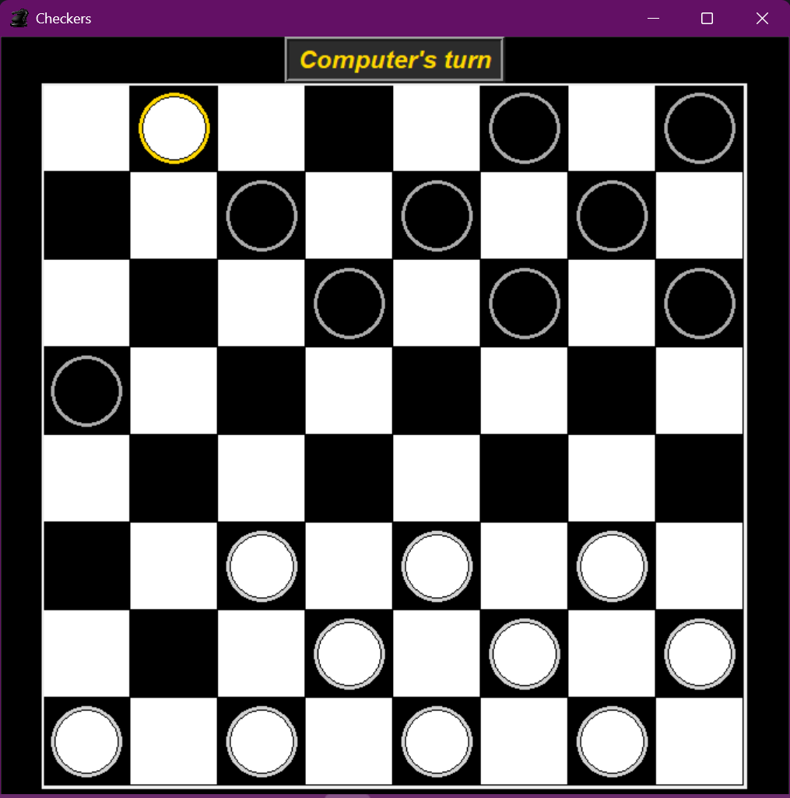
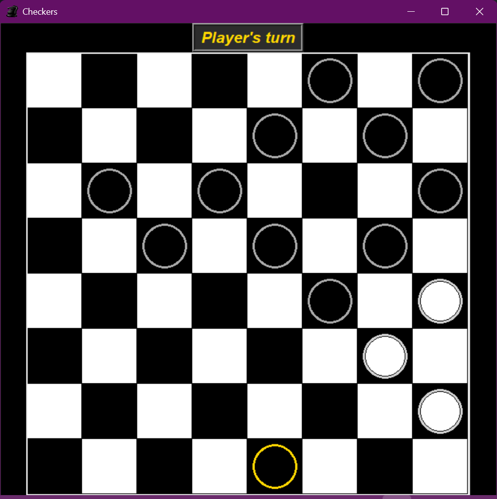

# A Python-based Checkers Game using Tkinter and TensorFlow Neural Network
TkCheckers is a classic checkers game built using Python and the Tkinter library for the graphical user interface (GUI). The project demonstrates the implementation of game logic, player moves, and GUI design in Python. Moves are generated by a neural network. 

  

